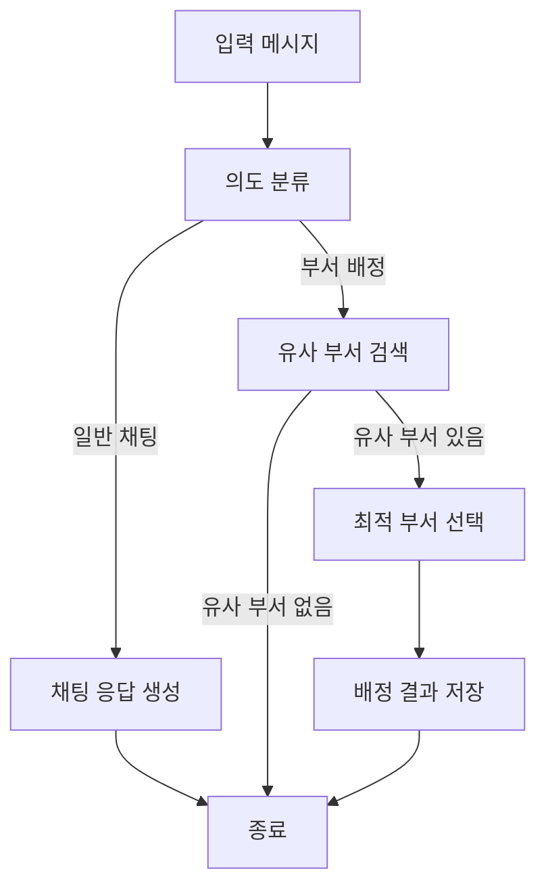

# LangGraph 기반 Department Assignment Agent

KURE 임베딩 모델과 GPT-4 mini를 활용하고, LangGraph로 워크플로우를 관리하는 지능형 부서 배정 시스템

## 개요

이 시스템은 LangGraph를 사용하여 사용자 문의를 분석하고, 자동으로 일반 채팅 또는 부서 배정 중 적절한 동작을 선택합니다.

- **LLM 기반 의도 분류**: GPT-4 mini가 문의 내용을 분석하여 처리 방식 결정
- **임베딩 모델**: KURE-v1 (한국어 특화 임베딩)
- **워크플로우 엔진**: LangGraph (상태 기반 워크플로우 관리)
- **데이터베이스**: Supabase

## 설치

1. 의존성 설치:
```bash
pip install -e .
```

2. 환경변수 설정:

`env.template` 파일을 참고하여 `.env` 파일을 생성하세요:

```bash
cp env.template .env
```

`.env` 파일에 다음 정보를 입력하세요:
```
SUPABASE_URL=your_supabase_url_here
SUPABASE_KEY=your_supabase_key_here
OPENAI_API_KEY=your_openai_api_key_here
```

## 워크플로우



### 의도 분류 기준

**1. 일반 채팅 (`chat`)**
- 인사: "안녕하세요", "반갑습니다"
- 감사: "감사합니다", "고맙습니다"
- 단순 질문: "부서가 어떻게 되나요?", "날씨 어때요?"
- 부서 처리가 필요 없는 대화

**2. 부서 배정 (`assign_department`)**
- 구체적인 업무 처리 요청: "급여 관련 문의입니다"
- 문제 해결 요청: "제품 불량이 발생했습니다"
- 시스템 오류: "로그인이 안 됩니다"
- 실질적인 업무/문제 처리가 필요한 문의

## 사용 방법

### 기본 사용

```python
from agent_langgraph import assign_department

# 메시지 ID로 부서 배정 또는 채팅 응답
status = assign_department(
    msg_id="message_123",
    threshold=0.7,  # 유사도 임계값 (기본값: 0.7)
    top_k=5         # 검색할 최대 부서 수 (기본값: 5)
)

if status == 1:
    print("부서 배정 완료! assigned_message 테이블을 확인하세요.")
else:
    print("일반 채팅으로 처리되었거나 배정할 부서가 없습니다.")
```

### 반환 값

- `status == 0`: 
  - 일반 채팅으로 처리됨
  - 또는 threshold를 넘는 유사 부서가 없음 (비정상 문의)
  
- `status == 1`: 
  - 부서 배정 성공 (배정된 부서는 assigned_message 테이블에 저장됨)

### LangGraph State

시스템은 다음 상태를 관리합니다:

```python
class AgentState(TypedDict):
    msg_id: str                          # 메시지 ID
    content: str                         # 메시지 내용
    intent: str                          # "chat" 또는 "assign_department"
    similar_departments: List[dict]      # 검색된 유사 부서 목록
    selected_dept_ids: List[str]         # 선택된 부서 ID
    response: str                        # 최종 응답
    threshold: float                     # 유사도 임계값
    top_k: int                          # 검색할 부서 수
```

## 데이터베이스 구조

### 필요한 테이블

1. **message 테이블**
   - `msg_id` (TEXT, PRIMARY KEY)
   - `content` (TEXT)

2. **department 테이블**
   - `dept_id` (TEXT, PRIMARY KEY)
   - `dept_name` (TEXT)
   - `dept_desc` (TEXT)

3. **assigned_message 테이블**
   - `msg_id` (TEXT, FOREIGN KEY)
   - `dept_id` (TEXT, FOREIGN KEY)

## 특징

1. **동적 의도 분류**: LLM이 문의 내용을 분석하여 자동으로 처리 방식 결정
2. **한국어 특화**: KURE-v1 모델 사용으로 한국어 문의 처리에 최적화
3. **유연한 워크플로우**: LangGraph를 통한 명확하고 확장 가능한 워크플로우
4. **다중 부서 배정**: 여러 부서가 관련된 경우 모두 배정 가능
5. **자동 DB 저장**: 배정 결과를 자동으로 Supabase에 저장
6. **Fail-fast 설계**: 의도하지 않은 오류 발생 시 즉시 예외를 발생시켜 디버깅 용이

## LangGraph vs 기존 방식 비교

### 기존 방식 (agent.py)
- ❌ 고정 threshold 기반 필터링
- ❌ 모든 문의를 부서 배정으로만 처리
- ✅ 단순하고 빠름

### LangGraph 방식 (agent_langgraph.py)
- ✅ LLM 기반 동적 의도 분류
- ✅ 일반 채팅과 부서 배정을 자동으로 구분
- ✅ 확장 가능한 워크플로우 (새로운 노드 추가 용이)
- ✅ 각 단계별 상태 추적 및 디버깅 편리

## 확장 가능성

LangGraph 구조 덕분에 쉽게 확장할 수 있습니다:

1. **새로운 노드 추가**
   ```python
   workflow.add_node("escalate_to_human", escalate_node)
   ```

2. **조건부 분기 추가**
   ```python
   workflow.add_conditional_edges(
       "search_departments",
       lambda state: "escalate" if state["urgency"] == "high" else "select",
       {"escalate": "escalate_to_human", "select": "select_departments"}
   )
   ```

3. **새로운 의도 추가**
   - `classify_intent_node`의 프롬프트만 수정하면 새로운 의도 추가 가능

## 참고 자료

- [KURE 임베딩 모델](https://github.com/nlpai-lab/KURE)
- [LangGraph 문서](https://python.langchain.com/docs/langgraph)
- [OpenAI API](https://platform.openai.com/docs)
- [Supabase 문서](https://supabase.com/docs)

## 트러블슈팅

### LangGraph 관련 오류
```bash
pip install --upgrade langgraph langchain langchain-openai
```

### 의도 분류가 정확하지 않을 때
`classify_intent_node` 함수의 프롬프트를 조정하여 분류 기준을 명확히 하세요.

### 부서 검색 결과가 없을 때
`threshold` 값을 낮춰보세요 (예: 0.5)

